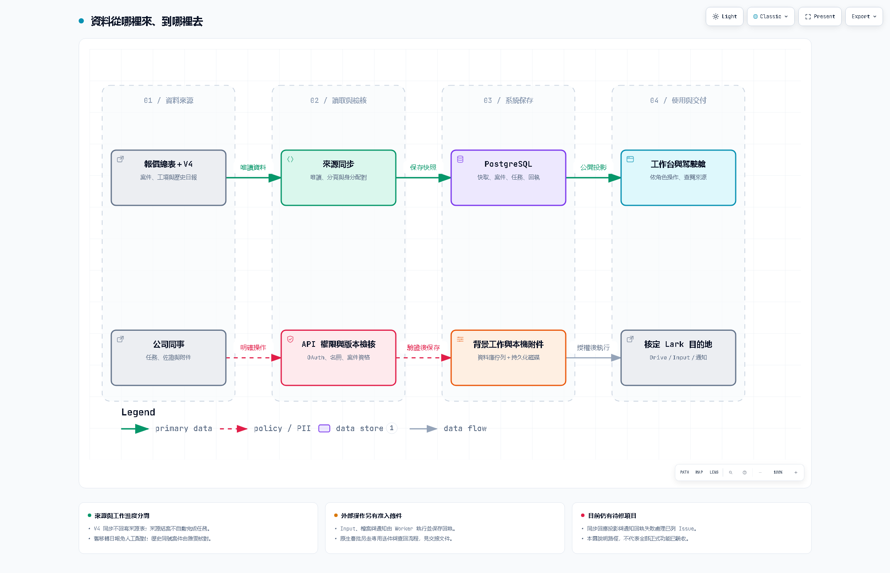

# 系統交接與資料流向

更新：2026-10-03（台灣）。適用程式基準：`e66c626`。本輪更新文件與審查追蹤，沒有部署新業務程式，也沒有把待修問題標為完成。

接手者請先讀本頁，再看[使用說明](user-manual.md)及[Code Review 報告](code-review.md)。舊部署文件保留原始日期；與本頁的最新業主決策衝突時，以最新決策為準。

## 接手時先掌握的狀態

| 項目 | 已有證據 | 尚待處理 |
|---|---|---|
| V4／報價來源 | 10/01 正式同步 9 表、2,605 列，290 筆案件可見 | 不是今日即時數量；同號來源整理仍待雅雯回覆 |
| 歷史日報 | 業主確認未配對的一批是舊系統移轉資料 | 免逐筆核對、免補配對，不列上線門檻；舊畫面提示尚未更新 |
| 案件執行 | 全部核定來源可見，含已結案；保留執行歸屬 | 可見不等於可派工。10/01 驗收仍保留 pending 執行歸屬 |
| 真實登入 | 管理帳號已正式 OAuth 驗收；一般角色有合成測試 | 普通同事本人登入、案件權限及交付仍需驗收 |
| 原生審批 | 定義、綁定與 QA 已有歷史證據 | 兩位指定本人共同核准及查回仍未完成；不可代按或拿 QA 結果套用正式案 |
| 備份 | 曾完成異地密文往返及獨立 PostgreSQL 還原 | 金鑰分離保管、常態排程、同版 24 小時觀察尚未完成 |
| 本輪完整測試 | 1,368 passed、1 failed，402.35 秒 | 失敗是收集時產生未來時間的測試；不能寫成全綠 |
| Code Review | 既有 10 項＋本輪新增項目有獨立追蹤 | 修正、重驗與部署分開，不因文件完成而結案 |

## 全貌：兩條資料路徑



[開啟可互動資料流圖](dataflow.html)。圖中文字為繁體中文；圖檢視器內建控制介面使用英文。

上排是「讀入來源並呈現」；下排是「同事操作後保存與外送」。圖中箭頭表示資料傳遞，不表示所有外部能力都已完成正式驗收。原生審批及備份另有下述流程。

### 每種資料的來源、處理與去向

| 資料 | 從哪裡來 | 系統如何處理 | 保存／最後去向 | 成功依據 |
|---|---|---|---|---|
| 報價、確認單、工項 | 核定 Lark 報價總表及 V4 共 9 張來源表 | 完整分頁、Base＋table＋record 三元組識別、確認单關聯、保留手動操作值 | source_caches 原始快照；business_records 的案件及來源集合；前端公開投影 | 表格 ready、last_sync、來源身分一致；不是只看 HTTP 200 |
| 歷史日報 | V4 外業／內業工作與成本關聯 | 匯入可辨識日期、組別、案件證據；不自動完成任務 | daily_reports／daily_unmatched | 舊移轉未配對資料免人工核對；新資料另按有效來源規則处理 |
| 同事名冊 | 核定名冊來源 | application 身分唯讀、在職及身分檢核 | company_people＋名冊同步狀態 | 新鮮成功讀取時間及個別員工准入，不用 worker 心跳代替 |
| OAuth 身分 | 使用者在 Lark 本人登入 | state、租戶、應用、在職名冊驗證；由伺服器計算管理授權 | auth_sessions 暫時 session；company_people 身分證據；簽章 Cookie | /api/session 與 /api/workspace 均成功，角色及 namespace 正確 |
| 任務、排程、成果 | 同事在工作台明確操作 | 案件可執行、角色、SOP、版本與審核條件 | business_records，workspaces.version，action_audit；瀏覽器重新取得公開資料 | 新版本及對應成果／確認狀態，不以本機草稿代替 |
| Input 登錄 | 節點中的 Input 表單 | 固定 request_id、目的表白名單、追加計畫、Worker 寫入後讀回 | 本地 input_revisions／jobs；核定專用 Lark 登錄表 | succeeded＋讀回欄位與計畫一致。不是回寫報價、V4 原始表或薪資 Base |
| 附件 | 同事上傳檔案或提供來源連結 | 分類、版本、用途、20 MB 上限、角色與案件檢核 | 本機持久化 /data/uploads；metadata＋file job；核定 Drive 根目錄 | 本機保存與 Drive remote_status=verified 分開確認 |
| 提醒通知 | @ 提及、確認單、摘要等明確動作 | 收件人、案件與外送政策驗證 | jobs／steps／receipt；Lark IM | 遠端 message_id 及本地回執。queued 不代表送達 |
| 原生審批 | 變更、展延、跳過或重大財務草稿 | prepare 綁定案件版本、定義、席次與證據；submit 固定 UUID；poll 查回 | 本地申請、native_binding／native_receipt；Lark 原生審批实例 | binding_verified 與有效核准席次；業務套用仍須另過驗證 |
| 備份 | 正式 DB 快照與已提交附件 | 一致性快照、SHA256、加密分塊、異地讀回 | 本機備份目錄；獨立備份應用的 Drive；空白隔離還原目標 | 密文往返、資料列及附件 hash 一致；排程與金鑰保管另驗收 |

來源表可見與財務／個資公開是不同議題。已知同步 POST 原始回應及人員事件有投影缺陷，見既有 #33、#34；目前不能把「設計有投影」描述成所有出口都已安全覆蓋。

## 程式與部署位置

| 路徑 | 負責內容 | 修改後至少檢查 |
|---|---|---|
| frontend/src/App.tsx、Operations.tsx | 頁面、角色操作、任務與管理介面 | build、桌面／手機、真實流程按鈕、錯誤恢復 |
| frontend/src/api.ts、drafts.ts | HTTP、登入過期、分頁草稿 | 非 JSON 回應、401/403、案件與使用者切換 |
| backend/app.py | API、OAuth、session、交易、附件 | 權限撤銷、JSON 型別、版本衝突、回應投影 |
| backend/workflow.py、operations.py、policy.py | 任務、交接、SOP、業務動作 | 角色矩陣、節點條件、歷史狀態、動作冪等 |
| backend/sources.py、v4_sources.py、source_sync.py | 來源讀取、映射、同步 | 完整分頁、身分衝突、重複同步、来源刪除與手動值保護 |
| backend/production_access.py、people_directory.py | 准入、名冊、管理授權 | 租戶／應用一致、名冊時效、停權與降權 |
| backend/native_approval.py、native_routes.py、native_poller.py | 原生送審、查回與綁定 | UUID 不重送、未知狀態、共同核准、輪詢公平性 |
| backend/jobs.py、lark_adapter.py、remote_policy.py | 外送及遠端目的政策 | 每個遠端呼叫前重驗、回執保存失败、目的變更 |
| backend/storage.py、audit.py | 正規化業務資料及稽核 | 重複 ID、交易回滾、查詢資料量 |
| scripts/run_service.py、run_worker.py | 容器內 web／worker／backup 監督 | 子程序失敗處理、UID10001、心跳与名冊健康 |
| scripts/backup_restore.py、backup_schedule.py、backup_offsite.py | 備份、排程、加密與恢復 | 空目標還原、附件校驗、失败可重試、未知遠端結果 |
| Dockerfile、deployment/source-tables.json | 映像與來源清單 | Node22／Python3.12、鎖檔、來源白名單、volume |

正式容器以 FastAPI 提供前端 build，不以 Vite dev server 對外服務。run_service 監督 web、worker；有 BACKUP_DIR 才啟動 backup 子程序。任一非預期子程序結束會使整組退出，交由主機平台重啟。系統使用 DB 中的 jobs，沒有另外部署 Redis／Celery。

## 資料庫與檔案的分工

| 儲存位置 | 內容 | 交接注意 |
|---|---|---|
| workspaces | namespace、版本及工作區 metadata | demo、test-lark、lark 正式區不可混用 |
| business_records | kind／entity_id／parent_id 對應案件、節點、任務與各業務集合 | 不是一個任意 JSON 檔可直接覆蓋；由 storage 在同一交易保存 |
| company_people | 公司正式人員及測試區覆蓋資料 | 身分與業務角色不同；系統管理員不自動取得財務核准席次 |
| auth_sessions | OAuth nonce、暫時登入資料 | portable backup 排除；還原後重新登入 |
| receipts | 操作 request_id 與 fingerprint | 重送須沿用識別且內容相同；不可手動刪掉來迫使重送 |
| source_caches | 私有原始來源快照與同步狀態 | 不公開上 GitHub；公開 API 必須投影 |
| action_audit | 操作人、結果、版本、實體差異 | 目前分頁仍全量掃描，歷史量增大需優化 |
| /data/uploads | 依 workspace hash 分隔的不可變附件 | 必須持久化 volume；DB metadata 不等於檔案已在 Drive |
| BACKUP_DIR | daily、monthly zip 及排程／異地狀態 | 與 uploads 分開；容量、保留與加密狀態需監控 |

## 啟動、設定與版本交付

本機示範用 SQLite；正式用 PostgreSQL。不要把本機 SQLite 測試結果當成正式交易與部署驗收。

```powershell
# 在專案根目錄；使用獨立 Python 環境
python -m pip install -r backend/requirements.txt
Set-Location frontend
npm.cmd ci
npm.cmd run build
Set-Location ..
.\scripts\start_local.ps1 -Port 8000
```

上列 requirements.txt 是範圍依賴，適合開發啟動；正式 Docker 安裝 backend/requirements.lock 並驗證 hashes。本輪機器的 Python3.11／SQLAlchemy1.4 與正式 Python3.12／SQLAlchemy2 不同，發布前要在鎖定映像再跑一次完整測試。不要直接將目前機器的 pip freeze 覆蓋正式鎖檔。

| 設定群組 | 用途 | 保管方式 |
|---|---|---|
| APP_ENV、DEMO_MODE、PUBLIC_ORIGIN | 環境與 HTTPS 網域 | 正式關閉 Demo；變更留版本回執 |
| DATABASE_URL、SESSION_SECRET、UPLOAD_DIR | DB、簽章、附件磁碟 | 由部署秘密設定提供，文件只寫名稱 |
| LARK_APP_ID／SECRET／REDIRECT_URI／ALLOWED_TENANTS | OAuth 與專用應用 | 保留正確應用和公司，不借用 CLI 憑證 |
| LARK_WORKER_ORGANIZATION／IDENTITY | 來源背景讀取身分 | 來源為核定 application 身分；不是最後登入主管的 token |
| LARK_SOURCE_TABLES_JSON／V4_BASE_TOKEN／QUOTE_BASE_TOKEN | 核定來源 | 以目前部署與 source-tables.json 核對，不貼私有快照 |
| LARK_DRIVE_ROOT、Input 專用目的設定 | 外部寫入目的 | 分開正式與測試；Drive 根目錄仍有 #35 待補防護 |
| 原生審批定義及啟用設定 | 定義驗證與正式送件 | 沿用現有 QA instance，不因交接重新建單 |
| BACKUP_* | 排程、加密、獨立異地身分 | 金鑰與密文分開保管；不把整個 env map 放公開文件 |

.env.example 是範本，程式不會自動讀 .env。更新部署變數須先讀取最新完整設定，合併指定變更、比對、讀回；不得用舊設定檔整份覆蓋。

發布流程：固定 commit → 全測試與 build → 封裝 smoke → 確認可還原備份 → staging 與角色驗收 → 正式發布 → 核對版本／UID／volume／健康 → 同版 24 小時觀察。GitHub push 只更新版本庫，不表示 Zeabur 已部署。

## 常見故障怎麼接手

| 現象 | 先看什麼 | 正確處理 | 不要做 |
|---|---|---|---|
| 登入後被拒絕 | /api/session、名冊成功時間、tenant/app、active | 查名冊及員工准入；由核定維修入口恢復 | 用名字猜 open_id、直接開 manager 或放寬 tenant |
| 來源頁顯示歷史日報待核對 | 是否為業主已確認的旧移轉批次 | 按最新決策免核對，保留紀錄，追蹤提示更新 | 要求雅雯補全部舊日報，或假裝配對成功 |
| 案件只能查看 | execution_system、source_reference、角色 | 依核定流程確認案件執行歸屬 | 因看得到就直接改 DB 啟用 |
| 409 版本衝突 | 最新 workspace/project version | 保留文字，重讀、比對後再操作 | 改 request_id 連點重送外部副作用 |
| Input／通知／上傳 outcome_unknown | 同一 UUID、job、遠端回執 | 先只讀查回，確認原請求結果 | 直接重送；#37 通知回執缺陷未修時尤其注意 |
| 附件 queued／blocked | worker、目的目錄、角色、回執 | 區分本機已保存與遠端未驗證 | 把 queued 截圖當作交付成功 |
| 審批一直 PENDING | Lark 原始实例、綁定、本人席次、poll 時間 | 查回同一实例；大量歷史案注意輪詢飢餓問題 | 重建審批或代替本人核准 |
| 備份狀態異常 | status.json、磁碟容量、密文讀回、key custody | 保存錯誤與未知 bundle，隔離恢復核驗 | 刪未知回執、把備份與金鑰放同一共享位置 |

/api/health 只證明 web 能連 DB。管理員的 /api/admin/runtime-health 才包含 worker、名冊、備份等狀態；但顯示健康仍不能代替真人審批或附件真實送達驗收。

## 備份與恢復交接

portable backup 保存 6 張業務表與已提交的本機附件，排除登入 session。正式 PostgreSQL 快照使用 REPEATABLE READ；附件按 DB 引用及 hash 檢核。異地備份使用獨立應用與密文，不能把應用附件 Drive 和備份目的混為一談。

恢復必須在停止寫入的隔離服務、空白 DB、空白 uploads 進行。先驗證 manifest/hash，再恢復，逐表及逐檔比對，確認 session 沒被恢復，最後才進行登入與只讀 smoke。具體指令見 [備份啟用手冊](../BACKUP_ACTIVATION_RUNBOOK_20260929.md) 與 scripts/backup_restore.py --help。

目前新發現：如果附件已寫入、DB insert 失敗，回滾只刪檔案而留下空目錄，下次恢復被「目標非空」拒絕。先保存失敗證據，選新的空白隔離目標重驗；不要為了重試對正式 uploads 做遞迴刪除。永久修正應只清理本次新建且仍為空的目錄。

## 更新順序與責任交接

1. 先修資料投影、附件撤權、遠端目的及未知結果處理；逐項跑負向驗收。
2. 更新 Vite／esbuild，保留鎖檔，重新 build 與瀏覽器流程測試。官方已修版本及本次 npm audit 詳見審查報告。
3. 修交接可見性、原生 poller 公平性、備份回滾、API 錯誤處理、草稿隔離及指標。
4. 落實歷史日報免核對的畫面／指標範圍，保留來源紀錄；同號案件按雅雯的逐組回覆處理。
5. 統一正式版本的 Python／DB 測試環境、修時間依賴測試、建立持續整合 gate。
6. 完成真人兩席、普通同事流程、金鑰分離與常態備份，再做同版觀測。

| 角色 | 需交付的事項 | 目前狀態 |
|---|---|---|
| 開發維護者 | Issue 修正、測試、版本／部署對照 | 待指定實際接手人；不在文件臆造負責人 |
| 業務資料核對 | 34 組歷史同編號案件的保留／關聯決定 | 已傳朱雅雯私有核對文件，尚未收到核對結果 |
| 部署／維運 | volume、告警、同版觀察、部署回滾 | 待交接並留驗收回執 |
| 備份保管人 | 獨立金鑰保管、常態排程與還原演練 | custody 尚待確認 |
| 本人驗收者 | 原生審批兩席、一般同事登入及交付 | 需本人執行，不由代理代按 |

公開版本庫只保存去識別化文件、示範截圖及程式。雅雯核對文件、公司快照、CLI/session 設定、.runtime、金鑰與真實案件名稱均不納入本套公開交接附件。

## 依據與延伸閱讀

- [10/01 正式來源與駕駛艙紀錄](../COMPANY_COCKPIT_RELEASE_20261001.md)：正式歷史證據與限制。
- [來源可見性決策](../SOURCE_VISIBILITY_DECISION_20260930.md)：全部來源可見與業務執行分開。
- [前版交接](../RELEASE_HANDOFF_20260930_LATEST.md)：保留回執歷史，不當作今天即時狀態。
- [Code Review 報告](code-review.md)：本次證據、優先序與未修項目。
- [GitHub 既有追蹤總覽](https://github.com/jekaihsu/YXMEEGLE/issues/32)、[第一輪審查](https://github.com/jekaihsu/YXMEEGLE/issues/43)。
