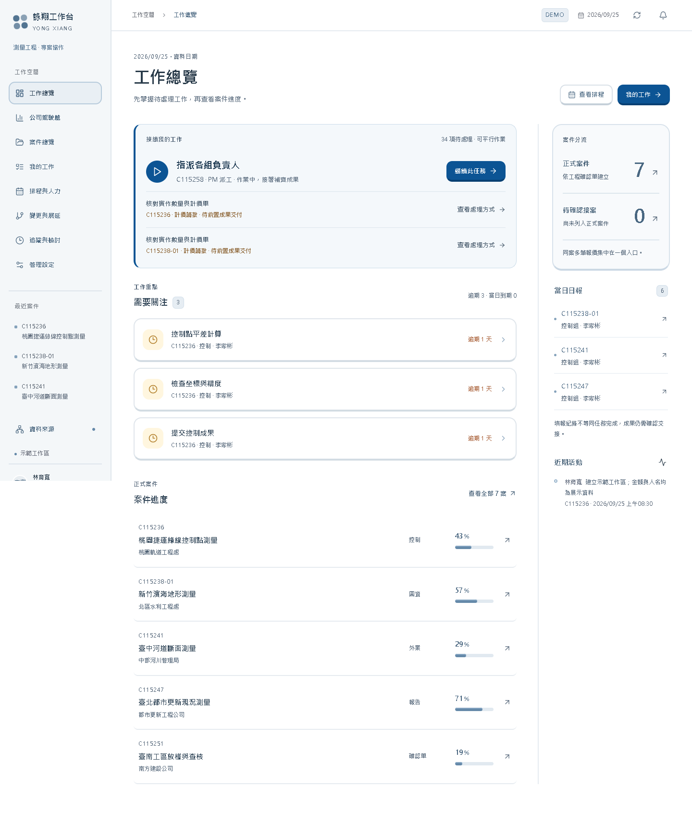
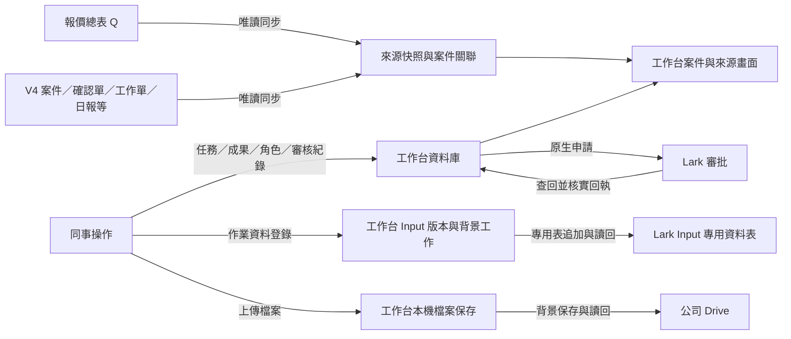
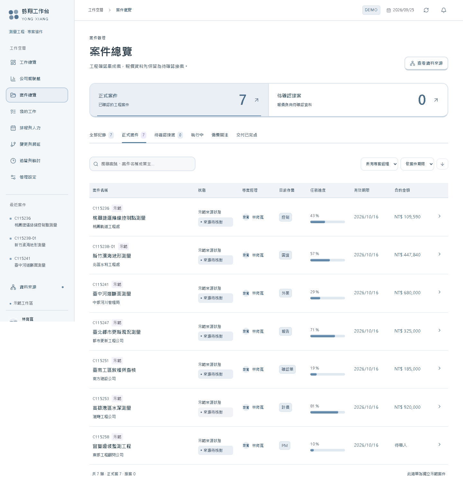
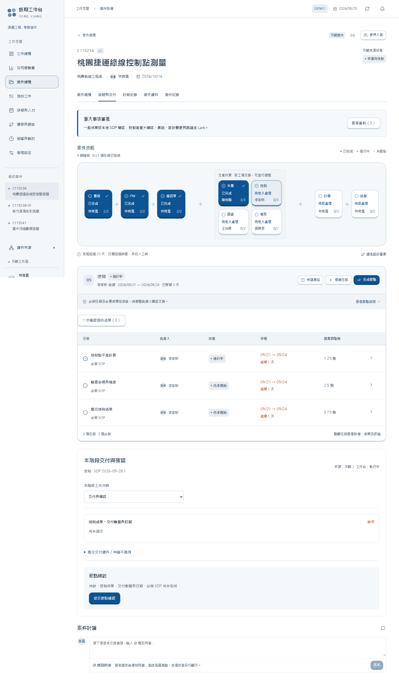
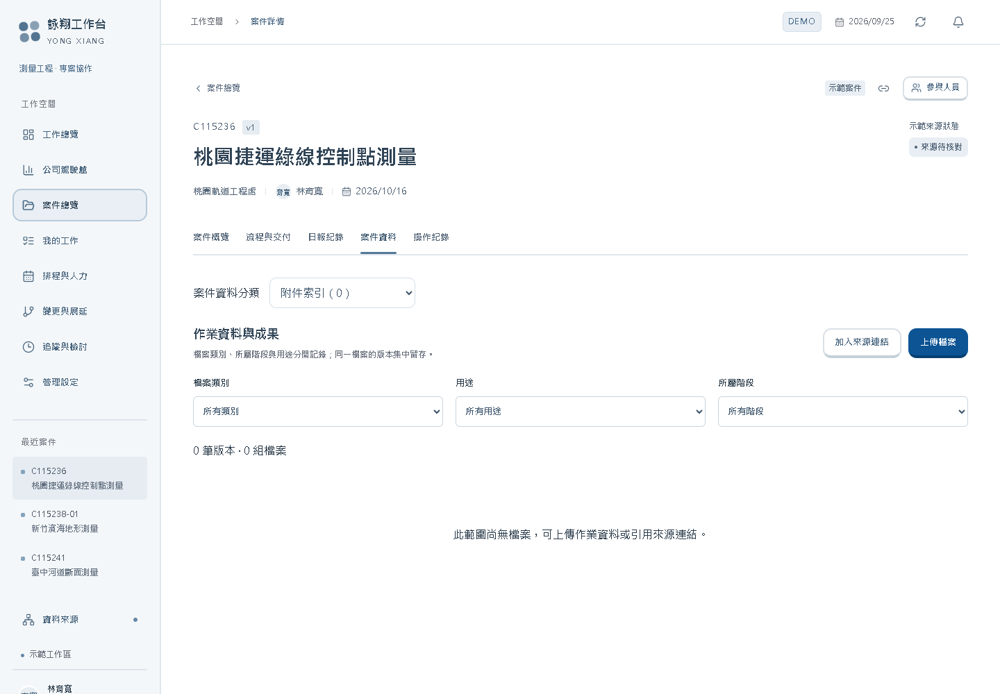
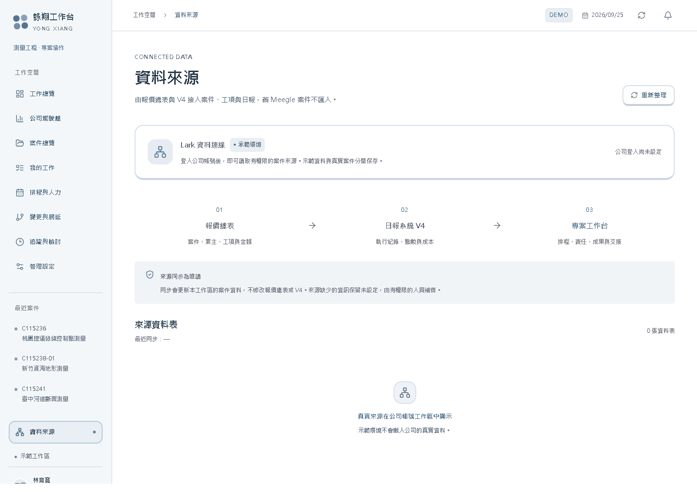
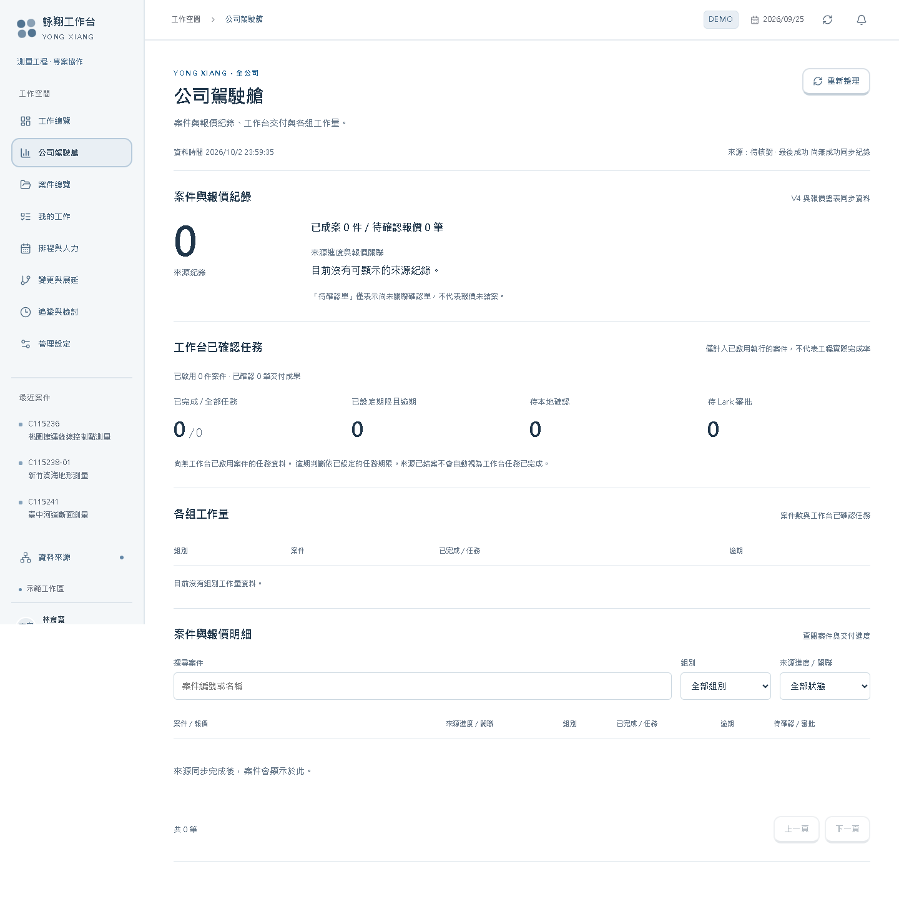

# 詠翔專案工作台使用說明書

版本日期：2026-10-03。對象：新進同事、組員、PM、組主管、行政及系統管理員。

本手冊依目前程式介面撰寫。圖片使用隔離 DEMO 假資料，供辨識位置與學習流程，**不代表正式環境已通過驗收**。按鈕依身分、案件執行歸屬及串接設定顯示；看不到按鈕時，先核對這三件事。

## 1. 第一天先看這一頁

一般同事的日常路徑是：**登入 → 確認正式／測試區 → 我的工作 → 打開任務 → 看作業資料 → 開始 → 填成果並附檔 → 完成任務 → 送交節點確認 → 查看確認結果**。

請先記住五個差別：

| 畫面上看見的事 | 實際代表 | 還不能代表 |
|---|---|---|
| V4 案件已顯示 | 系統讀到了來源資料 | 本工作台已獲准接管此案 |
| 任務已完成 | 負責人已提交該任務成果 | 整個節點、工程或款項已完成 |
| 檔案可下載 | 工作台已有此版本 | Drive 已保存並核實 |
| 已送往 Lark | 申請已送出或正在查核 | 已核准、已套用 |
| 日報已有紀錄 | 來源有作業紀錄 | 成果已交付、節點已確認 |

圖 1 閱讀順序：先看左側工作區與登入人員，再看「接續我的工作」，最後看需要處理的條件。紅色或逾期數字只是追蹤入口；對已停用 SOP 任務等情況，應進案件核實，不能直接當成績效結論。

## 2. 資料從哪裡來、放在哪裡、往哪裡去

| 資料 | 起點 | 工作台保存的內容 | 後續去向及成功依據 |
|---|---|---|---|
| 報價、案件、原日報 | 報價總表及 V4 | 同步快照、來源 ID、來源關聯 | 顯示於案件／資料來源；看成功同步時間與原紀錄 |
| 任務進度及成果文字 | 同事在工作台輸入 | 任務版本、成果、操作者及操作紀錄 | 交給指定確認人；看任務與確認輪次狀態 |
| 作業資料 Input | 案件節點的「作業資料登錄」 | 提交識別、內容、版本及背景工作 | **專用 Input 表追加**；看「已登錄並核實」 |
| 實體檔案 | 同事選擇的檔案 | 本機持久化檔案、分類、用途、版本與工作紀錄 | 公司 Drive；看「Drive 已上傳並讀回核實」 |
| 外部來源連結 | 同事貼上的網址 | 網址及描述 | 仍留原系統；沒有自動複製檔案或修改原權限 |
| 變更、展延、重大財務確認 | 工作台申請草稿 | 申請內容、綁定版本及回執 | Lark 原生審批，再查回工作台；核准後依流程套用 |
| 正常班表 | Attendance 或人工核對資料 | 人員、日期、正常下班時間與依據 | 用於預排期限；未知班表保留待設定 |

**來源同步是讀取，不會把工作台的修改自動寫回 V4 或報價總表。Input 專用追加也不是修改 V4 原案。** 工作台本機檔案保存、Drive 保存與系統備份是三件不同的事。

## 3. 登入、角色及工作區

### 登入步驟

1. 使用管理員提供的工作台網址；不要使用他人的登入連結或憑證。
2. 在「登入公司工作台」按「使用 Lark 登入」，使用自己的公司 Lark 帳號完成授權。
3. 回到工作台後，看左下角姓名、角色，以及「公司正式區」「獨立測試區」或「示範工作區」。
4. 如登入狀態尚未完成，按「重新檢查」。若顯示停用、名冊未核實或不屬於允許公司，把錯誤文字交管理員核對。

| 身分或職責 | 日常工作 | 判斷方式 |
|---|---|---|
| 組員／任務負責人 | 處理自己有權執行的任務、交付成果 | 以該任務的有效執行權限為準 |
| PM | 案件分派、排程、交接與申請 | 不代表對每個案件都有相同權限 |
| 組主管／指定確認人 | 覆核交付、確認指定輪次 | 看案件、節點指定職責及有效代理 |
| 行政 | 指定的財務共同確認等 | 依正式流程及指定席次操作 |
| 系統管理員 | 人員、連線、執行歸屬及維運 | 管理權與某項業務的雙人確認不能混為一談 |

同組看得到任務，不代表可以替負責人完成。需要代理時，應完成系統內的授權與有效期間；交接需按流程核准並由接手人「接受交接」。不要借用帳號。

目前已知限制：主管代提交接時，接手人可能看不到「接受交接」操作（[#45](https://github.com/jekaihsu/YXMEEGLE/issues/45)）。遇到此狀況請回報管理員，勿以借用帳號或直接改資料庫處理。

普通員工的正式 OAuth 登入與角色驗收仍需完成；管理員能登入或 DEMO 可切換角色，不能作為所有員工已可正常使用的證明。

## 4. 找到正確案件，確認是否由工作台執行

1. 左側進入「案件總覽」。預設區分「正式案件」與「待確認接案」。
2. 用「搜尋案件」輸入案號、案名或業主；必要時調整「所有專案經理」及排序。
3. 點進案件，先核對案號、案名、來源與 PM，再看「案件執行歸屬」。
4. 同號出現多筆時，應依來源記錄與已確認的關聯選案；不要只靠案號替另一筆派工或上傳。

| 執行歸屬 | 可做什麼 |
|---|---|
| 歸屬待核定／`pending` | 查閱來源；暫不由工作台派工與交付 |
| Meegle 執行 | 此案留在 Meegle 執行至完成，工作台供參考 |
| 本工作台執行 | 可依各人的權限在工作台辦理任務與交付 |

管理員核定時使用「核定案件執行歸屬」，選擇「執行系統」、填寫「核定依據」，按「保存歸屬核定」。這是實際業務決定，不應為了讓按鈕能按就隨意切換。若顯示其他人已更新歸屬，先「捨棄草稿並載入最新歸屬」，重新核對。

來源顯示「結案」不會自動完成工作台任務；報價尚未關聯確認單也不能直接解讀為報價尚未結案。

### 已確認的歷史資料處理政策

舊系統搬入、無法配對案件的歷史日報 **免逐筆核對，也不列為上線門檻**。目前 UI 可能仍顯示「待配對」「前往配對核對」等舊提示；不要因此要求同事重新整理這批歷史日報。這個例外針對已確認的舊系統移轉資料，不等於任意忽略之後的新異常。

目前 34 組同號、共 68 筆歷史案件紀錄，已另以私人文件請雅雯核對。這是一次性歷史整理，不預設未來持續發生；本手冊不公開案名、來源 ID 或核對內容。收到核對結果前，不自行刪除、合併或改寫來源。

## 5. 找工作與九個流程節點

「我的工作」提供「指派給我」「同組工作」「所有任務」，並可依狀態與案號搜尋。一般先用「指派給我」，再打開具體任務。工作總覽的「前往此任務」「繼續此任務」也可帶到同一工作。

| 節點 | 使用時先核對 |
|---|---|
| 業務 | 來源報價、案型及業務負責人 |
| PM | 案件責任、作業範圍、分派與排程 |
| 確認單 | 本案對應確認單與應交資料 |
| 外業 | 作業資料、前置條件、原始成果及證明 |
| 控制 | 適用工項、輸入資料、成果及覆核 |
| 圖資 | 上游交付、圖面版本及成果 |
| 報告 | 應交報告、技術佐證及交付批次 |
| 計價 | 來源金額、核准成果及重大財務確認 |
| 結算 | 結清佐證、應付款確認與正式共同核准 |

九個節點是導覽架構，不代表所有案件一定依序做完同一套工作。實際任務、平行工作、前置依賴、不適用條件與必交資料，以本案 SOP 版本及當前檢核為準。目前 SOP 來源對照仍有部分待完成，不能把已看到的範本當成已完整複製所有舊系統流程。

### 完成一項任務

1. 核對負責人；看「作業說明」「作業資料」及前置成果。
2. 若顯示「前置成果尚未交付」「公務證明尚未核准」或「目前暫停作業」，依提示回到對應工項／交付／審批處理。
3. 按「開始此任務」，實際進行作業。排程啟用不代表已記錄你的實際開始時間。
4. 在「成果與交接說明」填實際完成內容、檔案位置、版本與下一位需知道的事項。不要只寫「完成」。
5. 用「上傳成果檔案」或「加入成果連結」補齊附件；確認正確案件、節點及用途。
6. 按「完成並前往下一項」。確認任務狀態與成果文字已保存，再繼續。

成果文字存入工作台任務紀錄；實體檔案另走 Drive 背景保存。任務完成不能取代檔案保存核實，也不能代替主管確認。

### SOP 更新、不適用及跳過

案件保留案內 SOP 版本；發布新範本不表示所有舊案自動換版。需按案內更新申請，核准後使用「核准套用新增任務與文件規則」。遇到未結原生審批等阻擋，交管理員核實，不用刪申請繞過。

「申請跳過此節點」需填跳過原因及對後續工項、交付、業主承諾的影響。由 PM 與該組主管兩位不同人共同核准，PM 再「套用已核准的跳過」。核准跳過保留原任務與成果，且不會自動解除其他工項對前置成果的要求；財務與結算不適用此一般跳過流程。

## 6. 作業資料 Input 登錄

在案件對應節點的「作業資料登錄」操作；正式或已配置的隔離真實測試環境、案件可執行且具權限時，才顯示可提交表單。

1. 填「資料名稱」及「作業資料內容」。過大內容改用檔案交付；UI 同時限制字數與 50 KB 大小。
2. 按「提交作業資料」。看到「已交由背景工作登錄」時，只代表受理。
3. 查看下方該版本的狀態，直到「已登錄並核實」。
4. 如發生網路錯誤而內容鎖住，保留該筆內容及提交識別，用「重試確認送交結果」核對同一次提交。
5. 若紀錄是「結果待核實」，用「查回核實原登錄」。不要重建同樣內容來猜測是否成功。

| 狀態 | 下一步 |
|---|---|
| 等待登錄／登錄中 | 等背景工作處理後更新畫面 |
| 已登錄並核實 | 工作台版本與遠端專用 Input 紀錄已完成核實 |
| 結果待核實 | 查回原登錄；不盲目另送一筆 |
| 登錄受阻／登錄失敗 | 將時間、案件、節點、原紀錄狀態交管理員 |
| 模擬登錄 | 只證明模擬流程，不是正式寫入 |

未送出的內容可用「清除草稿重新填寫」。已嘗試提交後的鎖定是避免重複的保護；若卡住，請管理員處理原紀錄，不以換瀏覽器反覆提交作為解法。

## 7. 檔案上傳、版本與 Drive 核實

1. 在案件檔案頁「作業資料與成果」按「上傳檔案」。
2. 選「檔案類別」「所屬階段」「用途」。用途分「作業資料」「作業成果」「交付佐證」。
3. 「版本歸屬」選「新增一組檔案」或原檔案的「上傳新版」，避免新版散落成不同檔案組。
4. 選擇本機檔案，按「上傳檔案」。工作台先保存此版本，再由背景工作保存至 Drive。
5. 在列表核對名稱、版本、階段、上傳者及保存狀態。等待狀態更新，必要時按「更新保存狀態」。
6. 看到「Drive 已上傳並讀回核實」後，用「開啟 Drive 原檔」確認預期檔案。

| 顯示 | 如何解讀 |
|---|---|
| 工作台暫存，尚未核實 Drive 保存 | 僅能確認工作台現有版本 |
| Drive 等待上傳／正在上傳／核實 | 已排入背景工作，不必再次上傳 |
| Drive 已上傳並讀回核實 | 此版本有遠端保存及讀回證據 |
| Drive 保存受阻／失敗 | 由管理員查背景工作和授權 |
| Drive 結果待核實，請勿重複上傳 | 遠端結果不明，先查回原工作 |
| 測試模擬，未存入正式 Drive | 沒有正式保存證據 |
| 來源連結，未另存 Drive | 工作台只是引用網址 |

「加入來源連結」需填文件名稱與來源網址，按「儲存連結」。原系統的閱讀權限仍由原系統管理；同事打不開時，應請原文件擁有人授權。

「Lark 來源附件索引」只代表來源有附件資訊，不代表附件已下載或備份。誤件的撤下需保留理由及版本，不能靠重新命名掩蓋錯誤。

## 8. 交付成果與節點確認

1. 完成本節點適用的必做任務。
2. 到「本階段交付與確認」核對必交項目。依實際狀況提交資料、佐證或不適用申請，由指定主管覆核。
3. 如需「成果交付批次」，在「提交新批次／更新成果版本」填數量、單位，選本批工項和已覆核的技術佐證。換版要選被替換批次並填原因。
4. 查看「節點交付檢核」。尚缺項目需先處理，不能以日報或來源已結案代替。
5. 按「送交節點確認」。看到「待指定人員確認」代表小任務已保存，節點還未完成。
6. 指定確認人到「確認通過或退回」，選本次代表職責及結果；退回需填理由。
7. 查看本輪確認人、時間、結果與節點狀態。舊輪核准及舊成果版本不能當作本輪核准。

資料走向：任務成果與附件 → 工作台交付／批次 → 指定人確認紀錄 → 節點狀態。成果換版後，受影響確認及款項引用可能需重新核對；不要只看曾有一個綠色核准標誌。

## 9. 變更、展延及 Lark 原生審批

從左側「變更與展延」或案件對應審批區處理。先確認案件、受影響節點／任務、原因及申請內容，再保存草稿。改期應走適用展延流程，不能任意改原期限消除逾期。

正式原生審批的操作順序：

1. 核對草稿內容與指定確認人。需兩個不同人時，不能由同一帳號兼投兩票。
2. 在「Lark 審批」按「核對送審設定」。設定未齊只能保留草稿。
3. 條件通過後按「送出至 Lark」，到 Lark 完成真正的審批。
4. 回工作台按「查回原審批結果」，等待工作台核實原申請及回執。
5. 如該流程要求套用，由有權人員套用核准結果。檢查實際任務版本／期限／受影響範圍是否更新。

看到結果不明時，保留原申請，查回原結果。只有已確認未建立的情形，才依介面使用「重試原申請」或「結束未建立的申請」。已送出的撤回使用「撤回原 Lark 審批」，並核對撤回回執；按了撤回不等於遠端已撤回。

設計變更可能暫停受影響任務。核准與版本處理完成後，再依流程恢復工作；不要直接在暫停中的任務補寫完成。

**正式真人雙席原生審批仍待完整驗收。** DEMO 測試審批、具備按鈕、能建立草稿，都不能代替正式兩位真人核准與回傳證據。

## 10. 財務資料與結算

工作台的「來源財務資料」供核對；**不在這裡直接記帳、登錄收付款或替代原有帳務流程**。來源合約金額、成本數字不代表已核准、已收款或已結清。

需要正式重大財務確認時：

1. 先核實來源與交付佐證。
2. 在「重大財務確認」展開「建立財務確認草稿」。
3. 選「確認事項」（合約／款項／結算）及所屬階段，填確認原因，勾選正確佐證。
4. 結算相關的「本案無應付款」或「應付款已結清」是待審聲明，須附佐證並共同核准，不能只因選了選項就視為完成。
5. 按「保存確認草稿」，依上一章送往 Lark，由指定 PM、行政等實際席次處理。
6. 回執核實後，有權人員使用「核實條件並完成財務節點」，再查看最終狀態。

目前審查已發現跨案件財務表單草稿可能殘留的問題。**切換案件後，送出前重新核對案號、所屬階段、原因與全部佐證**；發現仍顯示上一案內容就停止送出並回報。隔離環境不建立正式財務審批。

## 11. 日報、排程與班表

### 查看日報

在案件「日報紀錄」選「本案已配對」「全部可見日報」或「待配對」，可搜尋人員、內容或案號，按日期篩選，以「上一頁」「下一頁」查閱。需要核實原內容時，按「開啟 Lark 原日報」。

日報來自原表唯讀同步，原日報檢核在 Lark 處理。資料可能受權限、篩選與載入範圍影響；查不到不代表確定沒有作業。舊系統移轉未配對日報按本手冊第 4 章免核對政策處理。

### 排程與人力

進「排程與人力」查看安排，再回具體案件任務核對負責人、開始日期、期限及前置條件。排程是預定，實際開始與實際交付仍由作業紀錄證明。未開始的排程啟用任務不能當作已投入工時。

管理員或具班表權限的人員可在「管理設定 → 日曆與連線」查看「正常下班班表」。正式環境使用「同步正常班表」查回 Attendance；人工核實則填「補充已核對班表」。

截止依當日正常班表，不因加班或打卡時間而延後。缺員工對應、缺班次或資料矛盾時保持待設定，不用假設人人 18:00 下班來判定逾期。休假與補班日另由有權人員維護。

「追蹤與檢討」的提醒、每工作日彙整與其他排程，須以實際設定及背景工作回執確認。頁面寫有時間規則，不代表背景程序已正常送出每次通知。

## 12. 看資料來源與公司駕駛艙

「資料來源」用於查同步狀態、來源表及關聯。要修原始內容，應循權限回原表修正，再等同步反映。同步失敗時，畫面仍可能保留上次成功快照；檢查成功時間，不能當成最新資料。

目前同步回應的欄位保護仍有待修項目；不要分享原始 API 回應、開發者工具輸出或含私人欄位的畫面。一般同事以業務畫面查閱，需要同步由具權限人員處理。

「公司駕駛艙」分為來源案件／報價紀錄、工作台已確認任務、各組工作量及案件明細。可按來源進度、組別及搜尋條件查看，再開啟案件追溯。

來源紀錄數不是去重後的合約數，任務完成比例不是工程實際完成率。工作台交付指標以已啟用執行案件為範圍；未排期限的任務不能判斷逾期。目前已知停用 SOP 任務可能影響統計，應以任務詳情核實，不能直接用總數做考核。若顯示「資料暫時無法更新」，保留的上次資料不是最新結果。

## 13. 草稿、網路中斷與錯誤恢復

草稿功能是部分表單的瀏覽器分頁暫存，**不是完整離線工作模式，也不是公司備份**。具草稿支援的內容保存在目前分頁的 sessionStorage，按使用者／工作區／用途分隔，24 小時後失效；登出會清除。不要假設換裝置、換分頁、關閉分頁或瀏覽器限制儲存後仍可取回；檔案選擇與所有表單欄位也不是都能恢復。

| 遇到情況 | 正確處理 | 確認恢復的依據 |
|---|---|---|
| 登入已失效 | 重新登入自己的公司帳號，核對工作區 | 姓名、案件及權限正確 |
| 無權限／帳號停用 | 請管理員核對名冊與指定職責 | 後端允許的操作恢復；不借帳號 |
| 操作未完成、資料已更新 | 載入最新資料，重看差異，再決定送出 | 最新版本與原草稿無錯案／覆蓋 |
| 網路斷線、一般保存逾時 | 先恢復連線並查看紀錄，確認是否已保存 | 原成果／操作紀錄可查，不只看提示 |
| Input 結果不明 | 查回原提交 | 原版本「已登錄並核實」 |
| Drive 結果不明 | 請管理員查背景工作與原遠端回執 | 該版本 `verified` 與遠端檔案 |
| Lark 審批結果不明 | 查回原審批，保留申請識別 | 原申請回執通過綁定核實 |
| 公司駕駛艙更新失敗 | 按「重試」或「重新整理」 | 最新讀取成功，不只看到舊資料 |

「管理設定 → 背景工作」及「追蹤與檢討 → 儲存與通知紀錄」可查工作狀態。**通知可能已送出但回執保存失敗**，因此不要看到「重試未完成步驟」就連續點擊；先請管理員確認原工作及遠端結果。這是目前待修風險之一。

遇到需要復原工作區或資料庫的情形，交維運人員依交接文件操作。不要自行重設示範區、切換工作區或刪資料來解決正式異常。例行備份、金鑰分開保管與正式還原目標仍待驗收，不能把已上傳 Drive 視為整套系統已備份。

## 14. 每天下班前與交接前檢查

- 今天處理的任務：正確案件、實際進度、成果文字已保存。
- 上傳的必要檔案：版本與用途正確，查看 Drive 核實狀態；受阻項目已交接。
- 待確認項目：確認人、輪次與退回原因清楚，未把「已送交」說成「已核准」。
- 變更／展延：原申請、受影響任務與遠端結果可追溯，未知結果未重複送出。
- 待辦交接：接手人、有效代理與期限已按流程設定；草稿未當成正式紀錄。

回報問題時附：發生時間與時區、正式／測試區、自己的角色、案件與節點識別、操作步驟、預期／實際結果、錯誤文字、是否已重試。用公司核准的私人管道傳遞真實案件資料；不要把金鑰、Token、薪資、私人授權內容或完整原始回應貼到公開 GitHub。

## 15. 目前使用邊界與文件依據

已接通的來源讀取不等於全流程正式驗收完成。仍需追蹤普通員工登入、真人雙席原生審批、常態備份與復原、SOP 完整對照及本輪程式審查修正。正式使用範圍由管理員依驗收證據核定。

本手冊核對的主要介面程式：`App.tsx`、`ProjectExecution.tsx`、`InputRegistration.tsx`、`FileWorkspace.tsx`、`DriveFileStorage.tsx`、`DailyRecords.tsx`、`NativeApprovalControls.tsx`、`Operations.tsx`、`CompanyCockpit.tsx`、`AttendanceWorkSchedules.tsx`、`drafts.ts`。圖片只作教學示意；實際狀態以所登入工作區的最新資料與回執為準。
