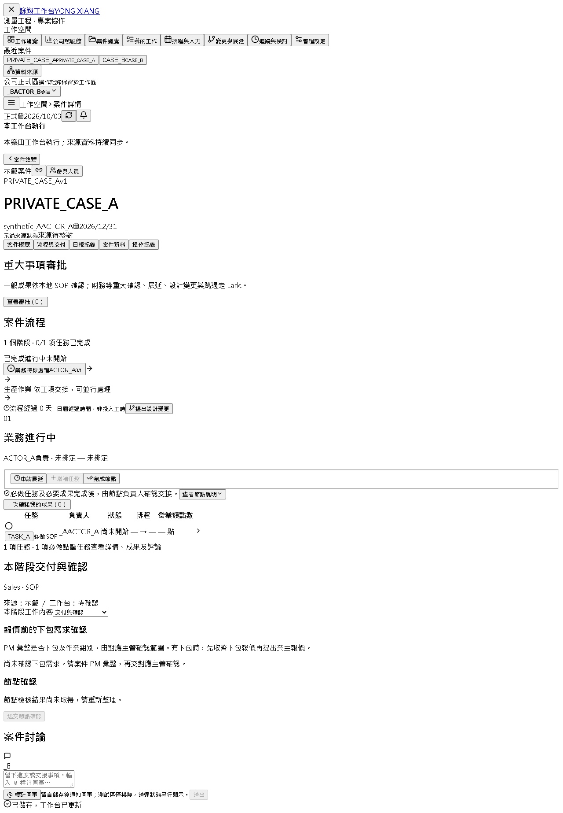
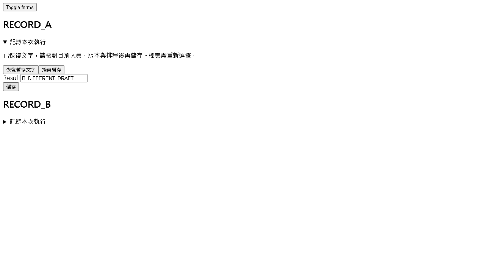

# 第三輪逐行 Code Review

2026-10-03（Asia/Taipei）。本輪由 4 位 agent 分工逐行閱讀 **160 個執行程式檔、17,244 行**，新增 **15 個確認缺陷：2 個 P1、12 個 P2、1 個 P3**；另補強既有 #41。這是審查交付，**15 項均尚未修復**。前兩輪的 18 項仍待處理，目前三輪共 33 項確認發現，不含需求待辦與審查總表。

[GitHub 審查總表 #68](https://github.com/jekaihsu/YXMEEGLE/issues/68) · [15 項完整證據與修復驗收](findings.md) · [逐檔覆蓋 CSV](coverage.csv) · [測試回執摘要](evidence/test-results.json)

## 先處理的問題

1. **#53 確認單版本與簽收未綁定**：v1 已發出及簽收，換成 v2 並撤下 v1 後，未重發 v2 就能完成確認節點。重現包含真實 Worker 的隔離模擬回執，並非直接填入核准結果。
2. **#63 身分切換後舊回應復活資料**：A 動作等待回應時切換為 B 並重新整理，A 資料一度清除；舊動作回應抵達後，B 身分畫面重新顯示 A 案件。證實前端資料隔離失效，未證實後端越權寫入。
3. **#54、#56 改派後舊席位仍可形成有效核准**：交付覆核接受舊主管；報價共同認定仍計入舊 PM 的票。需比對現任職責與有效版本，並保留歷史核准紀錄。
4. **#55 主管交接後接手人卡住**：案件主管與待審席位已更新，節點主管未更新；新主管投票持續回 409，重送審也無法解除。

P1 表示應優先修復的流程完整性／身分資料隔離問題；P2 為具體可觸發的功能錯誤；P3 為已證實但尚未重現業務資料損害的結構一致性問題。此處的定級不代表正式環境已發生事故。

## 全部新增發現

| 優先級 | Issue／問題 | 主要程式位置 |
|---|---|---|
| P1 | [#53 確認單換版仍沿用舊版收件確認，未重發也能完成節點](https://github.com/jekaihsu/YXMEEGLE/issues/53) | [backend/operations.py:213](https://github.com/jekaihsu/YXMEEGLE/blob/32caa8009e966d03574fa2f69a04a29653f333b7/backend/operations.py#L213) |
| P1 | [#63 身分切換後仍套用舊操作回應，重新顯示前一工作區資料](https://github.com/jekaihsu/YXMEEGLE/issues/63) | [frontend/src/App.tsx:95](https://github.com/jekaihsu/YXMEEGLE/blob/32caa8009e966d03574fa2f69a04a29653f333b7/frontend/src/App.tsx#L95) |
| P2 | [#54 交付批次改派主管後，仍允許舊主管核准](https://github.com/jekaihsu/YXMEEGLE/issues/54) | [backend/operations.py:656](https://github.com/jekaihsu/YXMEEGLE/blob/32caa8009e966d03574fa2f69a04a29653f333b7/backend/operations.py#L656) |
| P2 | [#55 主管交接未更新節點主管，接手人投票持續409](https://github.com/jekaihsu/YXMEEGLE/issues/55) | [backend/operations.py:804](https://github.com/jekaihsu/YXMEEGLE/blob/32caa8009e966d03574fa2f69a04a29653f333b7/backend/operations.py#L804) |
| P2 | [#56 報價共同認定在PM改派後仍計入舊PM的票](https://github.com/jekaihsu/YXMEEGLE/issues/56) | [backend/management.py:34](https://github.com/jekaihsu/YXMEEGLE/blob/32caa8009e966d03574fa2f69a04a29653f333b7/backend/management.py#L34) |
| P2 | [#57 試行複製保留附件索引但缺少檔案，下載404](https://github.com/jekaihsu/YXMEEGLE/issues/57) | [backend/app.py:698](https://github.com/jekaihsu/YXMEEGLE/blob/32caa8009e966d03574fa2f69a04a29653f333b7/backend/app.py#L698) |
| P2 | [#58 Bootstrap管理員降為在職成員後意外失去一般存取權](https://github.com/jekaihsu/YXMEEGLE/issues/58) | [backend/production_access.py:18](https://github.com/jekaihsu/YXMEEGLE/blob/32caa8009e966d03574fa2f69a04a29653f333b7/backend/production_access.py#L18) |
| P2 | [#59 部署資產核對失敗仍以exit0結束](https://github.com/jekaihsu/YXMEEGLE/issues/59) | [scripts/deploy_verify.py:88](https://github.com/jekaihsu/YXMEEGLE/blob/32caa8009e966d03574fa2f69a04a29653f333b7/scripts/deploy_verify.py#L88) |
| P2 | [#60 Drive子目錄未讀完分頁即判定唯一或建立新目錄](https://github.com/jekaihsu/YXMEEGLE/issues/60) | [backend/lark_adapter.py:208](https://github.com/jekaihsu/YXMEEGLE/blob/32caa8009e966d03574fa2f69a04a29653f333b7/backend/lark_adapter.py#L208) |
| P2 | [#62 部署前只核對manifest列出檔案，未拒絕額外檔案](https://github.com/jekaihsu/YXMEEGLE/issues/62) | [scripts/workbench_cloud_setup.py:110](https://github.com/jekaihsu/YXMEEGLE/blob/32caa8009e966d03574fa2f69a04a29653f333b7/scripts/workbench_cloud_setup.py#L110) |
| P2 | [#64 同標題表單草稿互相覆蓋，可將另一筆內容送入本筆紀錄](https://github.com/jekaihsu/YXMEEGLE/issues/64) | [frontend/src/FormDraft.tsx:7](https://github.com/jekaihsu/YXMEEGLE/blob/32caa8009e966d03574fa2f69a04a29653f333b7/frontend/src/FormDraft.tsx#L7) |
| P2 | [#65 換案查詢失敗後仍在新案件下顯示上一案稽核紀錄](https://github.com/jekaihsu/YXMEEGLE/issues/65) | [frontend/src/AuditTrail.tsx:6](https://github.com/jekaihsu/YXMEEGLE/blob/32caa8009e966d03574fa2f69a04a29653f333b7/frontend/src/AuditTrail.tsx#L6) |
| P2 | [#66 日報審核狀態列舉與API不一致，核准和退回皆顯示待查證](https://github.com/jekaihsu/YXMEEGLE/issues/66) | [frontend/src/DailyRecords.tsx:18](https://github.com/jekaihsu/YXMEEGLE/blob/32caa8009e966d03574fa2f69a04a29653f333b7/frontend/src/DailyRecords.tsx#L18) |
| P2 | [#67 日報換案保留舊分頁位置，顯示有資料卻無法翻回首筆](https://github.com/jekaihsu/YXMEEGLE/issues/67) | [frontend/src/DailyRecords.tsx:6](https://github.com/jekaihsu/YXMEEGLE/blob/32caa8009e966d03574fa2f69a04a29653f333b7/frontend/src/DailyRecords.tsx#L6) |
| P3 | [#61 可攜式恢復遺漏workspace外鍵，重啟亦不補回](https://github.com/jekaihsu/YXMEEGLE/issues/61) | [scripts/backup_restore.py:26](https://github.com/jekaihsu/YXMEEGLE/blob/32caa8009e966d03574fa2f69a04a29653f333b7/scripts/backup_restore.py#L26) |

各 Issue 與 [詳細報告](findings.md) 都列出觸發條件、實際結果、影響界線、程式行號及修復方向。#61 只證明恢復後外鍵缺失，不宣稱一般 API 能製造孤兒資料；#62 只證明部署入口允許額外檔案走到模擬派送，沒有實際上傳正式雲端。

## 「逐行」的實際範圍

審查基準為 [`32caa8009e966d03574fa2f69a04a29653f333b7`](https://github.com/jekaihsu/YXMEEGLE/tree/32caa8009e966d03574fa2f69a04a29653f333b7)。從每檔首行至末行閱讀，包含長單行 JSX、條件分支、權限重新驗證、狀態轉移、例外恢復、分頁與回應契約；工具輸出截斷處另外分段補讀，再對可疑路徑做局部重現。不是僅以關鍵字搜尋代替檔案閱讀，也不等同每個條件分支都跑過。

| 範圍 | 檔案 | 行數 | 分工 |
|---|---:|---:|---|
| backend 非測試 Python | 55 | 9,509 | 主代理、權限/API、背景工作代理 |
| frontend/src TS／TSX | 36 | 1,192 | 前端代理 |
| scripts Python | 69 | 6,543 | 主代理、權限/API、背景工作代理 |
| 合計 | 160 | 17,244 | 4 位 agent |

[coverage.csv](coverage.csv) 列出每檔名稱、末行、審查者及 SHA256。行數包含空白與註解；SHA256 是當時工作目錄檔案的位元組雜湊，受 CRLF／LF 影響，不是 Git blob ID。另閱讀 Dockerfile、.dockerignore、frontend/package.json 與 vite.config.ts，未把它們灌入上述 160 檔數量。主代理的 3 項工作流程重現另經權限代理交叉覆核。

本輪完整靜態覆蓋指上述 Python／TS／TSX 執行檔清單，**不包含完整測試程式庫、JSON 業務目錄、CSS、所有歷史文件、鎖檔內依賴原始碼、產物或 REVIT/**。相關測試有執行，不代表測試庫也全部逐行審完。未列缺陷的檔案亦不等於不存在問題。

## 動態驗證與限制

| 驗證 | 本輪結果 | 解讀 |
|---|---|---|
| 工作流程、API、投影、併發、Worker 等相關 pytest | 155 passed，109.68 秒 | 148 個既有案例 + 7 個新缺陷重現 |
| Drive／備份／部署 pytest | 4 passed，10.69 秒 | 3 項新缺陷，共 4 個重現案例 |
| 不重複 pytest 合計 | **159 passed** | 其中 **11 個案例證明缺陷存在** |
| 公開重現包搬移後驗證 | 11 passed，3.37 秒 | 同一批重現再次執行，不另加進 159 |
| 真實 React + Playwright | 5 個腳本、6 個情境 | 5 個新發現 + #41 的追加重現 |
| 公開前端重現包 | esbuild 編譯成功 | 已調整路徑與獨立 port；搬移後未再重跑全部瀏覽器情境 |

後端重現透過合成案件與獨立 SQLite 執行真正操作、HTTP 路由、Worker、backup/restore；遠端 HTTP 以 MockTransport／fake 函式取代。前端匯入真正 React 元件，用 fake fetch 控制回應順序及故障；日報 enum 另由真正後端投影函式產生。新重現的 assertions 刻意捕捉目前錯誤行為，**測試通過絕不表示問題已修好**；修復後須改成正確行為斷言並補負向案例。

本機 Python 3.11.5、SQLAlchemy 1.4.39；正式容器設計使用 Python 3.12 及鎖定依賴，不能把本機結果當作該組版本已驗收。未執行正式 PostgreSQL 恢復、真實 OAuth 換人、Lark 審批／通知送達、雲端發布或真實多人端到端。前兩輪全量後端 1,368 通過／1 失敗（#42），以及前端 production build 通過，屬前輪紀錄；本輪沒有重跑，不併入 159。

## 畫面證據

全部是合成案件／人員，`PRIVATE_*` 是測試標記。隔離 fixture 未載 CSS，以下是功能與狀態證據，不能當作正式產品外觀。

### #63：B 使用者畫面重新出現 A 案件

原 A 案件在重新整理後已消失，釋放延遲回應後又出現；畫面仍為 ACTOR_B。見 [JSON 回執](evidence/review3-frontend-epoch-evidence.json)。



### #64：A 紀錄恢復到 B 的草稿

畫面 RECORD_A 的輸入值為 B_DIFFERENT_DRAFT；提交回呼也收到這組錯誤對應。見 [JSON 回執](evidence/review3-frontend-draft-evidence.json)。



### #65：B 查詢失敗仍顯示 A 稽核

pB 的查詢返回合成 503，畫面仍列出 PRIVATE_AUDIT_A。見 [JSON 回執](evidence/review3-frontend-audit-evidence.json)。


日報兩項見 [JSON 回執](evidence/review3-frontend-daily-evidence.json)；該 JSON 是成功腳本輸出的觀察轉錄，並非原始瀏覽器遙測。評論跨案見 [JSON 回執](evidence/review3-frontend-comment-evidence.json)。

## 重現與交接

在已安裝本專案後端依賴的環境，於 Repo 根目錄執行：

```powershell
python -X utf8 docs/review3/run_reproductions.py
# 加跑本輪使用的八組既有相關測試：
python -X utf8 docs/review3/run_reproductions.py --related
```

runner 為子程序移除相關正式連線環境變數，建立獨立本機資料庫，結果寫入 `.runtime/review3-reproductions-*/`；不讀取 `.env`。11 個缺陷案例存於 [reproductions](reproductions/)。瀏覽器重現另見 [操作方式與依賴](reproductions/browser/README.md)：bundle 寫入 `.runtime/`，合成截圖寫入 `output/playwright/`。

修復順序建議先做 #53、#63，再處理改派與交接一致性（#54–#56），接著資料顯示／草稿（#64–#67、#41）、試行附件及一般員工降權（#57–#58），最後完成運維修正與正式環境演練（#59–#62）。每項以 Issue 的明確驗收條件結案；僅改提示文字不能修復資料綁定問題。

既有 [#41](https://github.com/jekaihsu/YXMEEGLE/issues/41) 新增證據：A 未送出的評論切換到 B 後，送出 payload 的 project_id 為 pB，內容卻是 A 草稿。與原草稿 scope 更新問題同根因，補入原 Issue，不重複計數。既有 #40 停用 SOP 統計亦有前端呼叫點需一起回歸，此輪未重複立項。

**保留業主決策**：舊系統搬入、對不到案件的歷史日報免逐筆核對，不列發布門檻；#66／#67 是新舊日報皆可觸發的 UI 契約／分頁錯誤。歷史重複案件明細仍留在私有核對流程，公開文件沒有加入公司案件、人員或憑證。

使用者操作及資料從哪裡來、往哪裡去，請接續 [使用說明書](../guide/user-manual.md)、[交接與資料流](../guide/handoff.md)、[離線圖文入口](../guide/index.html)。這輪審查補充上述文件的風險清單，沒有更改業務行為或部署狀態。
